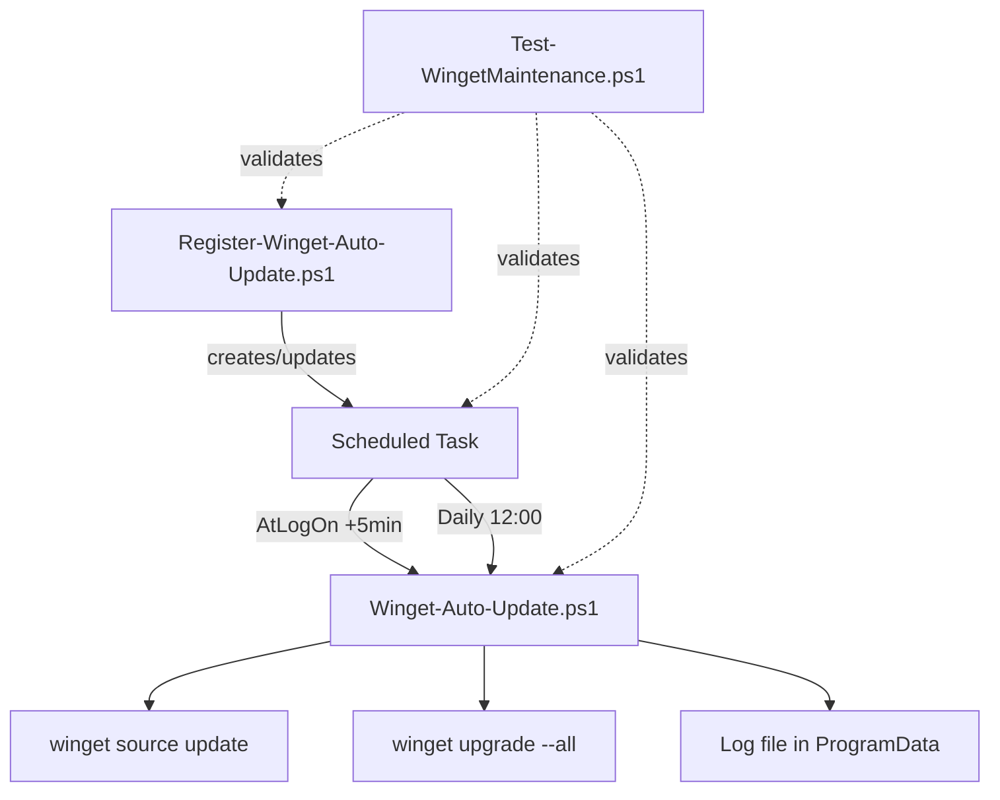
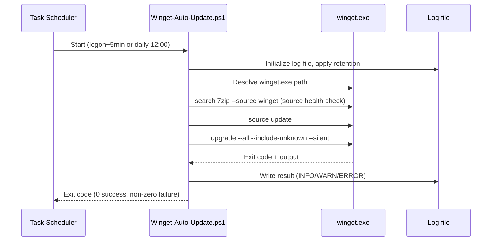

# Architecture

This document describes the internal design of WingetMaintenance: its components, how they interact, and the runtime behavior of the scheduled update process.

## Overview

WingetMaintenance consists of two independent PowerShell scripts and a small amount of state on disk (logs). There is no service, no database, and no network component beyond Winget itself.



## Components

### `scripts/Winget-Auto-Update.ps1`

The maintenance script itself. Responsible for:

1. Ensuring the log directory exists (`%ProgramData%\WingetMaintenance\Logs`).
2. Enforcing log retention (age-based and count-based).
3. Resolving the path to `winget.exe` via `Get-Command`, failing fast with a descriptive error if it is missing.
4. Creating a timestamped log file for the current run.
5. Validating that the Winget source is reachable (`winget search 7zip --source winget`).
6. Updating Winget's package sources (`winget source update`).
7. Upgrading all installed packages (`winget upgrade --all --include-unknown --silent ...`).
8. Writing structured, leveled log entries (`INFO` / `WARN` / `ERROR`) throughout.
9. Re-throwing errors so the scheduled task reports a non-zero exit code on failure.

The script is self-contained and idempotent: each run creates its own log file and does not depend on state from previous runs (other than log retention).

### `scripts/Register-Winget-Auto-Update.ps1`

A setup script, run once (or re-run after changes) by an administrator. Responsible for:

1. Verifying the maintenance script exists at its expected location.
2. Verifying it is running elevated (required to register a task with the highest run level).
3. Building a `ScheduledTaskAction` that invokes `powershell.exe` against the maintenance script.
4. Defining two triggers:
   - **Logon trigger**: fires 5 minutes after user logon, avoiding contention with other autostart processes (OneDrive, Defender, Windows Update, etc.).
   - **Daily trigger**: fires at 12:00 as a fallback in case the logon trigger is missed.
5. Defining a `ScheduledTaskPrincipal` that runs as the current (administrator) user with `S4U` logon type and `Highest` run level.
6. Defining `ScheduledTaskSettingsSet` for resilience: allowed on battery, wakes the computer, retries on failure (up to 3 times, 15 minutes apart), and enforces a 4-hour execution time limit.
7. Removing any pre-existing task with the same name before registering the new one (idempotent re-registration).

This script only configures the Task Scheduler; it does not perform any package updates itself.

### `scripts/Test-WingetMaintenance.ps1`

A read-only validation script intended for use after deployment (e.g., in a CI/CD pipeline or manual smoke test). Responsible for:

1. Confirming `winget.exe` is available.
2. Confirming the base and log directories exist.
3. Parsing both scripts with the PowerShell AST parser to catch syntax errors without executing them.
4. Checking that the scheduled task exists, has a non-SYSTEM principal, has at least two triggers, and has at least one action.
5. Reporting a pass/fail summary and exiting with a non-zero code if any check fails.

This script performs no upgrades and makes no changes to the system; it only inspects configuration and syntax.

## Runtime Flow



## Data & Storage

All runtime state lives under `%ProgramData%\WingetMaintenance`:

```text
%ProgramData%\WingetMaintenance\
├── Winget-Auto-Update.ps1          # Deployed copy of the maintenance script
├── Register-Winget-Auto-Update.ps1 # Deployed copy of the registration script
└── Logs\
    ├── Winget_2026-08-17_12-00-00.log
    └── ...
```

Using `ProgramData` (rather than a per-user profile) makes the scripts and logs available system-wide and independent of which user is logged on when the scheduled task runs.

### Log retention

- Log files older than **90 days** are deleted.
- A maximum of **100** log files is kept, oldest ones removed first.
- Retention failures are caught and logged as warnings; they never block the actual update run.

## Error Handling

- The maintenance script uses a single `try / catch / finally` block spanning the entire update logic.
- Any failure (missing Winget, unreachable source, failed `source update`, or failed `upgrade`) is logged as `ERROR` and re-thrown.
- Re-throwing ensures the PowerShell host process exits with a non-zero code, which Task Scheduler surfaces as a failed run — enabling monitoring via the "Last Run Result" column or `Get-ScheduledTaskInfo`.
- The `finally` block always logs a run summary and the log file location, regardless of success or failure.

## Design Principles

- **No third-party dependencies**: only built-in PowerShell cmdlets and `winget.exe` are used.
- **Fail fast, fail loud**: missing prerequisites (Winget, script files, elevation) raise descriptive errors immediately rather than silently continuing.
- **Idempotency**: both the maintenance run and the task registration can be re-executed safely without manual cleanup.
- **Separation of concerns**: registration (setup), execution (maintenance), and validation (testing) are three independent scripts, each with a single responsibility.
- **Auditability**: every run produces its own timestamped, UTF-8 log file with leveled entries.

## Related Documentation

- [docs/INSTALL.md](./INSTALL.md) — installation and setup steps
- [docs/CONCEPTS.md](./CONCEPTS.md) — background concepts
- [docs/TROUBLESHOOTING.md](./TROUBLESHOOTING.md) — known issues and fixes
